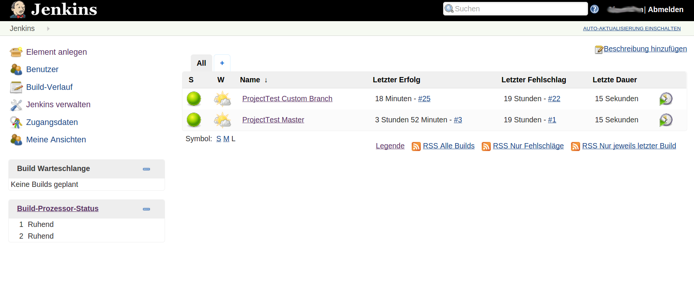
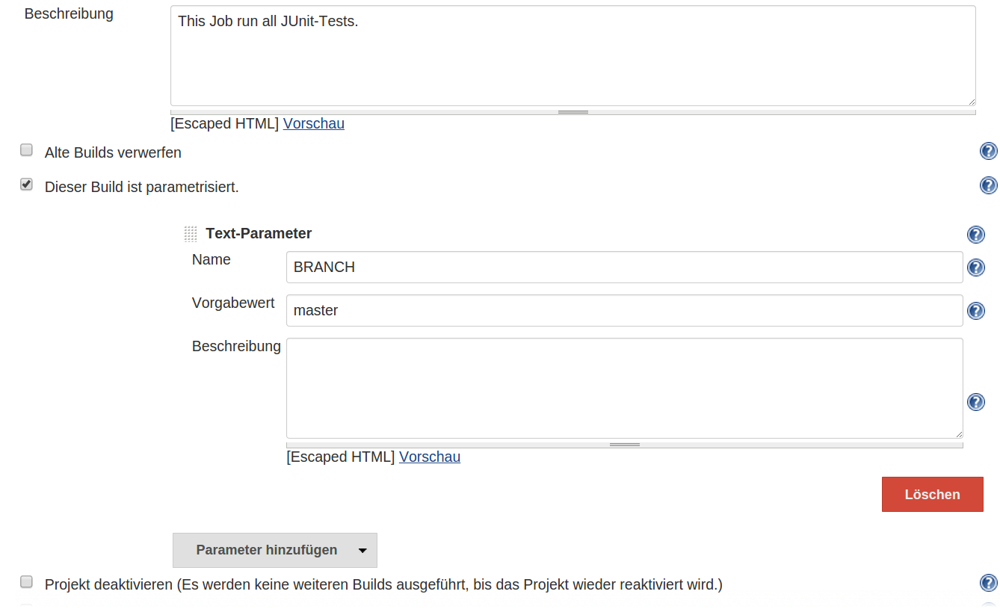

# Testen mit Jenkins

## 1 Einleitung

Dieses Tutorial soll die grundlegende Funktionalität und Verwendung von Jenkins beschreiben.
Hierfür wird ein kleines Maven-Projekt, welches aus einer Resourceklasse, und zwei Testklassen besteht, benutzt. Zur Versionsverwaltung wird Git verwendet. 



## 2 Jenkins einrichten

In diesem Kapitel wird beschrieben wie man neue Plugins installiert, und Jenkins für die Verwendung von Jobs eingerichtet. 

### 2.1 Plugins

Um Veränderungen an den Einstellungen von Jenkins vorzunehmen wird im Hauptmenü links der Menüpunkt "Jenkins verwalten" ausgewählt. Als ersten Schritt sollten die Plugins überprüft werden. Dies kann über den Menüpunkt "Plugins verwalten" erfolgen.
Damit dieses Projekt auf Jenkins funktioniert müssen folgende Plugins vorhanden sein:

* Git plugin
* JUnit plugin 
* Maven Integration plugin

Falls eines dieser Plugins fehlt kann es einfach über die verfügbaren Plugins nachinstalliert werden. Um die neuen Plugins benutzen zu können muss Jenkins neu gestartet werden. 

### 2.2 System konfigurieren

Als zweiter Punkt muss das System selbst konfiguriert werden. 
Am Server muss zunächst Maven und eine Java JDK (getestet mit Maven 3 und Java 7) installiert werden (Auf Debian-basierten System meist mit der Eingabe als root-Benutzer mit dem Befehl "apt-get install openjdk-7-jdk" für Java bzw "apt-get install maven" für Maven)
Nun muss Maven und Java in Jenkins konfiguriert werden.
Hier ein eine konkrete Konfiguration für das Betriebssystem Ubuntu 14.04, 32bit:
Dazu zum Menüpunkt "Jenkins verwalten" wechseln und danach auf "System konfigurieren". 
Dann beim Bereich "JDK" den Button "JDK hinzufügen" klicken, die Auswahl "Automatisch installieren" deaktivieren und bei Name "Java OpenJDK 7" und bei "JAVA_HOME" den Wert "/usr/lib/jvm/java-7-openjdk-i386" eingeben.
Bbeim Bereich "Maven" den Button "Maven hinzufügen" klicken, die Auswahl "Automatisch installieren" deaktivieren und bei Name "Maven 3" und bei "MAVEN_HOME" den Wert "/usr/share/maven" eingeben.
Danach auf den Button "Speichern" klicken.


## 3 Jobs erstellen

Nun kann das Projekt mit Hilfe von Jobs getestet werden. Jobs sind individuell einstellbar und können so verschiedene Branches testen, bestimmte Testklassen ausführen, Codestyle überprüfen, usw.
Die Erstellung von neuen Jobs erfolgt über den Menüpunkt "Element anlegen" im Hauptmenü links. 

### 3.1 Job zum Testen des Masters

In diesem Kapitel wird ein Job erstellt, welcher einmal am Tag den Master testet. Nach einem Klick auf "Element anlegen" muss ein Name und ein Job gewählt werden. Für dieses Projekt wird ein "Free Style"-Softwareprojekt bauen – Job benötigt. Der nächste Schritt ist die Konfiguration des Jobs, für den in den Bereichen Source-Code-Management, Build-Auslöser, Buildverfahren und Post-Build-Aktionen Einstellungen vorgenommen werden.

#### 3.1.1  Source-Code-Management

Unter diesem Punkt befinden sich die Einstellungen für die Versionsverwaltung. Nach der Auswahl von Git muss zuerst die Repository URL angegeben werden. Falls Git eine Authentifizierung benötigt, ist diese unter dem Menüpunkt Credentials erstelltbar. Die restlichen Einstellungen des Source-Code-Management benötigen keine Änderung. 

#### 3.1.2 Build-Auslöser

Der Build-Auslöser ist dafür zuständig, wann ein Job automatisch gestartet wird. Dies ist durch externe Quellen, oder einen Zeitplan bestimmbar. 
Um den Job einmal am Tag auszuführen wird "Builds zeitgesteuert starten" angehackt. Der Zeitplan ist so eingeteilt, dass alle Werte durch ein Leerzeichen, oder einen Tabulator getrennt sind:

```
MINUTE STUNDE TAG MONAT WOCHENTAG
```

Die wichtigsten Werte sind Zahlen selbst, * für alle gültigen Werte, und H für Hash. Um einen Job einmal täglich zu starten, könnte die Einstellung 0 0 * * * verwendet werden. Falls diese Einstellung durch mehrere Jobs benutzt wird, kann eine große Lastspitze um Mitternacht entstehen. Um eine optimale Verteilung der Jobs zu erreichen sollte aus diesem Grund H H * * * angewendet werden.

#### 3.1.3 Buildverfahren

Dieser Punkt steuert den Build des Projektes. Obwohl es möglich ist mehrere Schritte hintereinander durchzuführen, ist es in unseren Fall nicht notwendig. Im Dropdown-Menü "Maven Goals aufrufen" auswählen, und als Goals clean install verwenden, damit das Projekt korrekt gebaut wird.

#### 3.1.4 Post-Build-Aktionen

Der letzte Schritt ist dafür zuständig, was nach einem Build geschieht. Um die Ergebnisse der Tests auszugeben muss im Dropdown-Menü "Veröffentliche Junit-Testergebnisse" gewählt werden. Die Veröffentlichung benötigt die XML-Files aus dem Maven-Build. Durch die Eingabe von src/jenkinstest/target/surefire-reports/*.xml unter Testberichte in XML-Format findet Jenkins alle Testberichte von selbst. 

Nun kann der Job gespeichert, und über den Punkt "Jetzt bauen" ausgeführt werden. Zusätzlich startet er sich einmal am Tag von alleine.

### 3.2 Job zum Testen von auswählbaren Branches

Dieser Job ist bei Source-Code-Management, Buildverfahren und Post-Build-Aktionen ident mit dem ersten Job. Eine Konfiguration des Build-Auslösers ist nicht notwendig, da dieser nicht automatisch starten soll. 



Der Text-Parameter muss (siehe Bild) hinzugefügt werden. Durch das Ändern von "*/master" zu "$BRANCH"  bei Branches to Build wird nicht mehr der Master gebuildet, sondern der Branch des übergebenen Parameters. 
